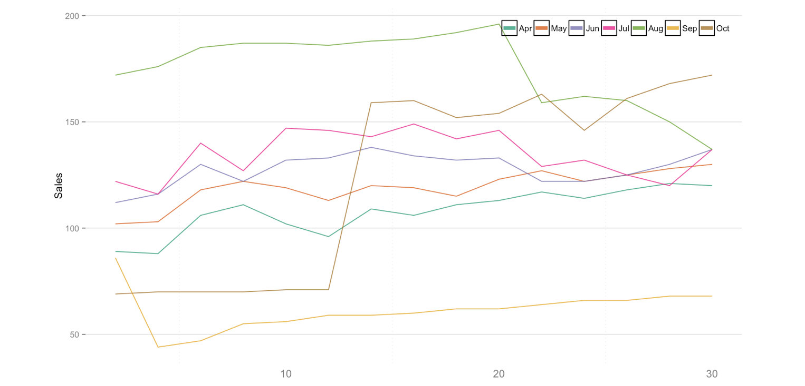
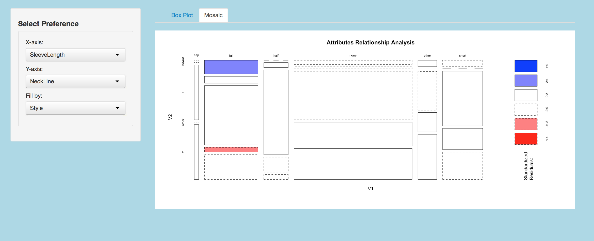
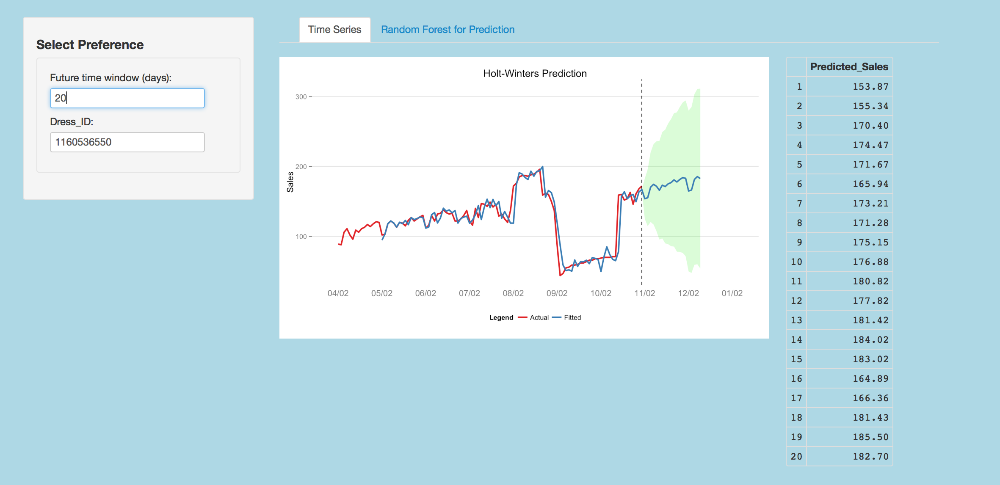
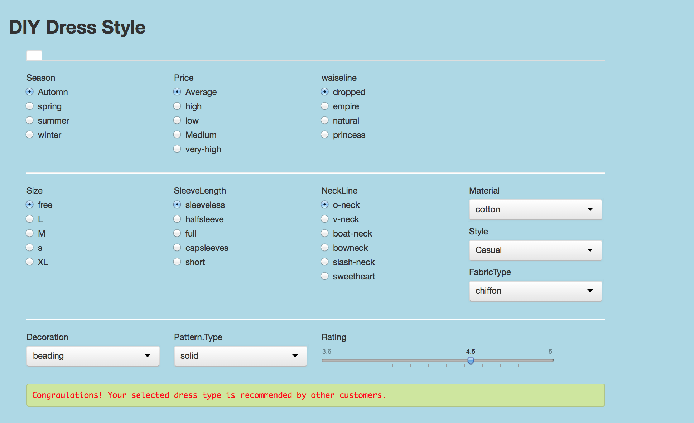

Final Project
==============================

| **Name**  | CAN JIN |
|----------:|:-------------|
| **Email** | cjin7@dons.usfca.edu |


# Instructions#

The following packages must be installed prior to running this code:
- `ggplot2`
- `shiny`
- `grid`
- `GGally`
- `reshape`
- `plyr`
- `scales`
- `reshape2`
- `MASS`
- `randomForest`
- `gridExtra`


To run this code, please enter the following commands in R:
```
library(shiny)
shiny::runGitHub('msan622', 'Cindy597', subdir='final-project')
```

# Discussion #

# Dataset #
My dataset is about dress sales for 550 different types of dresses distinguished by `Dress ID`. The dataset includes
historical sales records from 2013/04/02 to 2013/12/30, and several features, for example 'style', 'price', 'size' and so on.
And there is a binary variable called 'Recommendation' to indicate whether a dress is recommended for other
customers or friends.

The following is a three-sample subset to show what my dataset looks like:


My dataset preparation:

First, I merged the `Dress Sales.csv` and `Attribute Dataset.csv` together, since one of them includes numerical 
data, another includes categorical data, and both of them are useful for my visualization.

Second, I kicked out some useless columns in my dataset.

The code used for cleaning this dataset is shown below:
```
Dress_sales<-read.csv("/Users/cindy/Desktop/Dress Sales.csv", header=T, sep=",", quote="\"", na.strings="\\N")
Dresses_Attribute<-read.csv("/Users/cindy/Desktop/Attribute DataSet.csv", header=T, sep=",", quote="\"", na.strings="\\N")
mytotal<-merge(Dress_sales,Dresses_Attribute,by="Dress_ID") 
mytotal<-mytotal[,-c(25:36)]
write.csv(mytotal,file='merged_dress_sales.csv')

```


# Overview #

My shiny interface is developed for customer or managers to analyze sales trend of their interested dresses, explore insights about
features relationship, predict further sales trend of a specific dress, and finally get advice about whether a dress style designed by themselves will be recommended by 
other customers. The shiny interface includes five parts: `Search engine`, `Historical Sales Trend`, `Relationship Analysis`, `Prediction`, and `Recommendation`.

* The first page --- `Search engine` is just for customers or managers to find historical record for a specific dress by `Dress_ID` or its 
features, for example season, price, and so on. In addition, they can search for dresses which are satisfy their own preference.

* The second page --- `Historical Sales Trend` is for customers or managers to find out the trend of a specific dress.
In detail, there are two plots --- Heatmap and Multiple Line to show the big picture of 
sales trend for different dresses distinguished by `Dress ID`.

* The third page --- `Relationship Analysis` is for analyzing the relationship between features. This page is for managers to explore which features have
effect on the sales or price of a specific dress. Also, bar plot can address more detailed information by comparing several 
different dress types.

* The fourth page --- `Prediction`  is for predicting dress sales by time series and predict whether a dress will be recommended for other customers (by the binary 
variable 'recommend', its value is 0 or 1) by random forest. Manegers can set up their preference about time (days) to see the predicted sales trend for further 
31 days (1 month) or other time window. Also, managers or users also can see which variables are important for prediction whether a dress will be recommended or not 
based on the importance outpout of random forest model.

* The fifth page --- `Recommendation` provides advice for customers to 'DIY' their dress style by setting up very detailed preference information. A warning message or a 
congratulation message will show up to indicate whether their selected dress style is recommended by other customers based on the prediction　result of a Random Forest Model.

Overall, my shiny interface provide comprehensive functions for customers or manegers to explored detailed information about their interested dresses. What's more, 
the interface give advice for them to make better decision by modeling and prediction.


# Techniques #

## Technique One --- Heatmap ##


* How I encoded the data:
  First, I only used numerical variables --- sales record for this plot; 
  Second, I deleted `NA` values by using `na.omit`; 
  Third,  I melt and ordered the data by `Dress_ID`;
  In addition, I changed the time format by using `as.POSIXLT`;
  Last but not least, I scaled the months and set up my own limits and breaks for `scale_prgn` in Heatmap.
  
* Evaluation:
  The lie factor of this plot is 1 since there is no misrepresentation and the color of each cell is just based on the 
  accurate calculation of sales; The data-density is high enough in this plot; The data-ink ratio is good for this plot after
  I removed excessive axis titles, grid, tick marks, and legend.
  The code i used for this customization is :
  ```
      panel.background = element_blank()+
      theme(panel.grid.major.x = element_blank()) +
      theme(panel.grid.minor.y = element_blank()) +
      theme(axis.ticks.x = element_blank()) +
      theme(axis.text.x = element_text(size = 12)) +
      theme(axis.title.x = element_blank())
      
  ```

* Reason for choosing this technique (What I think the visualization excels at) : 
  The majority of my dataset is historical sales record for different types of dresses. A basic business 
  question I want to figure out is what is the trend of sales for a specific dress type. Heatmap is a good idea 
  for identifying a dress types' sales trend , and the heatmap enable comparisons among different months over day in a same view.  
  Heatmap helped me to examine the relationship between two variables. 
  For example, when I used `day` as x axis and `month` as y axis, I found out some buckets which have higher sales(blue buckets).

* What I learned about the dataset from the visualization:
  From the above heapmap, we can see the sales from August 5th to August 20th for this dress type were pretty high, and
  it reached maximum on August 20th; for April, May, and Jun, the sales trend for this dress type was very steady (keep moderate 
  sales record); while the sales decreased in September, and even closed to 0 in the end of October.
  

* Interactivity:
  
  
  * Select Dress_ID: 
    Paste in any Dress_ID you are interested in into the search box (copied from the previous search page); 
  * Filtering: 
    The user has the option to filter the visualization by month and day based on their interest;
  * Color Setting: The user can select any color scheme he/she prefer to control the color panel of the plot.
  


## Technique Two --- Small Multiples ##



* Reason for choosing this technique (What I think the visualization excels at) : 
  The Heatmap provides users a big picture about the sales trend of a dress, but users may be more interested in a 
  detailed and accurate sales trend with sales label on the plot to find business insights and then make business decisions. 
  A small multiples provides both overall trend and a little bit detailed sales information for users. In addition, the 
  Facet plot and Star-like plot gives other perspective to answer several different business questions.

* How I encoded the data:
  First, I only used numerical variables --- sales record for this plot; 
  Second, I deleted `NA` values by using `na.omit`; 
  Third,  I melt and ordered the data by `Dress_ID`;
  In addition, I changed the time format by using `as.POSIXLT`;
  Last, I changed month variable from numerical to factor, ordered it by normal month order
  instead of alphabetical order, and scaled the months, 
  
* Evaluation:
  The lie factor of this plot is also 1 since there is no misrepresentation and the trend of each line is just based on the 
  accurate sales record; The data-density is relative lower than Heatmap, however it is still reasonable for this plot
  (the density can be decreased by using `brushing`, which will be described  in the interactivity part); The legend makes the data-ink a little 
  bit low, but I think it is necessary in my plot to distinguish months. I think the data-ink ratio is good for this plot after
  I removed excessive axis titles, grid, tick marks.

* What I learned about the dataset from the visualization:
  From the above small multiples, we can see the detailed sales record by month and day. In general, the sales in August
  are higher than other months except October 28th to 30th. Also there is a sudden increase　sales in middle of October due to some unknown reason which need
  more data analysis to explore.


* Interactivity:
  

  * Select Dress_ID: 
    Paste in any Dress_ID you are interested in into the search box (copied from the previous search page); 
  * Filtering: 
    The user has the option to filter the visualization by month and day based on their interest;
  * Color Setting: The user can select any color scheme he/she prefer to control the color panel of the plot.
  * Brushing: The user has the option to brush the visualization by month to decrease the data-density of the plot for easy comparison.
  * Facet Plot:
    User can click the checkbox to see the facet plot to look insight about each month and compare all the months in a same view. 
  * Star-like plot: User can click the checkbox to see the star-like plot.
  
  
  
## Technique Three --- Boxplot ##

  

* Reason for choosing this technique (What I think the visualization excels at) : 
  As I mentioned before, there are several categorical variables in my dataset, for example, price, size,season, style and so on.
  Research the relationship between those features of a dress type is necessary for manegers and customers to make better decision,
  for example, the relationship between price and season can help product manager to set up price strategies for different season.
  Boxplot is a good technique for this purpose since it is not only indicates two variables' relationship, but also shows detailed 
  numerical information about variables relationship, for example, mean, standard error, and distribution range.

* How I encoded the data:
  First, I only used categorical variables; 
  Second, I deleted `NA` values by using `na.omit`; 
  Third,  I changed all the categorical variables' type to factor;
  In addition, I merged similar factor levels of a categorial variable together. For example, 's', 'S', 'Small',and 'small' are merged into a same factor level ;
 
* Evaluation:
  The lie factor of this plot is also 1 since there is no misrepresentation and the distribution and shape of box is just based on the 
  accurate rating vales by x variable; The data-density is relative high
  (the density can be increased or decreased by using different `fill by` variable, which will be described  in the interactivity part); 
  I deleted the original legend since it makes the data-ink a little bit low, and instead I created grey label on the top of the plot 
  to distinguish different categories of `fill by` variable. I think the data-ink ratio is good for this plot after
  I removed excessive axis titles, grid, tick marks, and legend.

* What I learned about the dataset from the visualization:
  From the above Boxplot, we can see that, no matter the price level of the dress, its ratings in summer are always higher than other
  season, which means dresses sold in summer was easier to get good rating. 
  
* Interactivity
  
  
  * Select x-axis: 
    The users have option to choose the x-axis variable they are interested in, for example, size, price, and so on.
    Due the data limitation, there is only one numerical feature variable --- Rating, which is used as y-axis (the y-axis is 
    always Rating for this Boxplot. 
  * Select fill-by variable:
    In addition to x-axis and y-axis, users can choose any fill-by variable they are interested in for grouping and comparison.
    
## Technique Four --- Mosaic Plot ##

  
  
  * Reason for choosing this technique (What I think the visualization excels at) : 
  	Boxplot shows users a basic numerical relationship between two variables. But for product manager or data analyst, the 
  	basic overview is not enough to make decision, a statistical relationship analysis is required to test linearity or multicollinearity before
  	building model and deeper analysis. Mosaic plot is a good technique to statistically test two variables' relationship based on standardized residuals (Pearson 
  	correlation). Based on the Mosaic plot, the analyst or manager can decide which categorical variables are reasonable to be included in a 
  	logistic regression model or Random Forest model.

  * How I encoded the data:
  	First, I only used categorical variables; 
  	Second, I deleted `NA` values by using `na.omit`; 
  	Third,  I changed all the categorical variables' type to factor;
  	In addition, I merged similar factor levels of a categorial variable together. For example, 's', 'S', 'Small',and 'small' are merged into a same factor level ;
 
  * Evaluation:
  	The lie factor of this plot is also 1 since there is no misrepresentation and the color of each box is just based on the 
  	accurate calculated Pearson correlation values; The data-density is relative low due to many empty boxes which indicate two factors are independent with each other; 
  	The legend makes the data-ink lower, but I kept it since it is necessary for users to distinguish different standardized residuals level. I think the data-ink is good for this plot.

  * What I learned about the dataset from the visualization:
  	From the above Mosaic, we can see 'free' size and 'High' price level dresses has relatively high negative correlation, while 'free' and 'L' size  positively correlated to 'low' price 
  	level dresses. Also, 's' size dresses have positive correlation with Medium price dresses.
  
* Interactivity
  
  
  * Select x-axis: 
    The users have option to choose the x-axis variable they are interested in, for example, size, price, and so on.

  * Select y-axis:
    Also, the users have option to choose the x-axis variable they are interested in.
    
  

## Technique Five --- Time Series Plot ## 

  
  
  * Reason for choosing this technique (What I think the visualization excels at) : 
    The Heatmap and Small multiples shows historical sales trend of dresses, but managers are more interested in the future sales trend of dresses 
    to set up price strategy. The time series plot shows both actual and fitted sales based on Holt Winters time series model in different colors 
    for comparison. Also, it provides predicted sales for future 10 days with green shadowed confidence interval.. 
    
  * How I encoded the data:
  	First, I only used numerical variables --- historical sales record; 
  	Second, I deleted `NA` values by using `na.omit`; 
  	Third,  built Holt winters time series model, and extracted both actual and fitted values; 
  	In addition, I merged actual and fitted values by time;
  	Last, melt sub data frame ('time', 'actual','fitted') by time.	
 
  * Evaluation:
  	The lie factor of this plot is also 1 since there is no misrepresentation and the lines are just based on the actual sales and 
  	accurate calculated fitted values; The data-density is relative low, but it is reasonable for a time series plot;
  	The legend makes the data-ink lower, but I kept it since it is necessary for users to distinguish actual or fitted sales. 
  	I think the data-ink ratio is good for this plot after I removed excessive grid and tick marks.

  * What I learned about the dataset from the visualization:
  	From the above Time series, we can see the fitted sales values are very close to the actual sales, which means the built
  	Holt Winters model is good for predicting sales. What's more, the plot shows predicted sales for the further 10 days sales, 
  	which is very important for managers to make business decision.
  	
  	
* Interactivity
  
  
  * Select Future time window (days): 
    The users have option to choose how many days in the future they want to see the prediction sales values;
  * Select Dress_ID:
    Also, the users have option to choose to predict which dress.
    
    


## Prototype Feedback ##

   * Got suggestion to create a recommendation engineer panel : If a user inputs a particular value of each feature, 
     he/she can get the output of whether he should buy a particular cloth.
     
     Changes I made: I created a recommendation engineer panel in my shiny interface. It looks like following:
     
     
     Users set up his/her own select preference about dress style, the recommendation engineer panel will automatically
     give advice about whether the dress type is recommended by other customers.
         
   *  Got suggestion about there are too many machine learning implemented, but this may not be the best place to do it since it has to recalculate every time. 
   
      Changes I made: Instead of many machine learning algorithms, I finally only chose Random Forest model for prediction to save running time.
      For a random forest model , the VarImpPlot could change every time due to the random nature of bootstrapping. So set the seed and wait
     until a user wants to train a different tree.

    * Got suggestion about putting all the sales on different days into the random forest data may not be valid since dresses that were sold more
      meant they were more popular, and thus would also have much higher rating compared to dresses that were not so good in sale. 
      Changes I made: Kicked out sales record from the random forest model, and only keep categorical variables, for example, price, seacon, size and so on 
      in the Random forest model to see which variables are importance to predict whether a dress is recommended by other customers.


## Challenges ##

* One of the challenge parts for me is encode data properly before apply it directly into ggplot2. Since every plot has its 
own characteristic and requirements of the data, it is hard and time-consuming for me to make changes of the data before every plot.
For example, even though small multiples and time series plot looks similar, but I need deal with the data independently for them since 
the data should be melt by different ID and based on different columns.

* If I have more time, I would like to implement deeper analysis as a data scientist. In addition to the Holt Winter time series analysis,
I will build different time series models, for example, moving average, ARIME, and SRIMA models to compare their accuracy. Similarly, in addition to 
Random Forest model, I also can implement logistic regression or Naive Bayes model to make this shiny interface more professional for other data analyst or 
data scientist to use. In other aspect, I will spend more time to improve my plots and the interactivity.

Overall,  in addition to the techniques I learned during this class, I also explored time series modeling and machine learning modeling possibilities in the shiny App.
I believe it is a great skill for me in my future study and work life. 
 


    
  
  
  
  
  