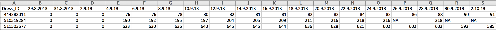

Final Project
==============================

| **Name**  | CAN JIN |
|----------:|:-------------|
| **Email** | cjin7@dons.usfca.edu |


## Instructions##

The following packages must be installed prior to running this code:
- `ggplot2`
- `shiny`
- `grid`
- `GGally`
- `reshape`
- `plyr`
- `scales`
- `reshape2`
- `MASS`
- `randomForest`
- `gridExtra`


To run this code, please enter the following commands in R:
```
library(shiny)
shiny::runGitHub('msan622', 'Cindy597', subdir='final-project')
```

## Discussion ##

## Dataset ##
My dataset is about dress sales for 550 different types of dresses distinguished by `Dress ID`. The dataset includes
historical sales records from 2013/04/02 to 2013/12/30, and several features, for example 'style', 'price', 'size' and so on.
And there is a binary variable called 'Recommendation' to indicate whether a dress is recommended for other
customers or friends.

The following is a three-sample subset to show what my dataset looks like:




My dataset preparation:

First, I merged the `Dress Sales.csv` and `Attribute Dataset.csv` together, since one of them includes numerical 
data, another includes categorical data, and both of them are useful for my visualization.

Second, I kicked out some useless columns in my dataset.

The code used for cleaning this dataset is shown below:
```
Dress_sales<-read.csv("/Users/cindy/Desktop/Dress Sales.csv", header=T, sep=",", quote="\"", na.strings="\\N")
Dresses_Attribute<-read.csv("/Users/cindy/Desktop/Attribute DataSet.csv", header=T, sep=",", quote="\"", na.strings="\\N")
mytotal<-merge(Dress_sales,Dresses_Attribute,by="Dress_ID") 
mytotal<-mytotal[,-c(25:36)]
write.csv(mytotal,file='merged_dress_sales.csv')

```


## Overview ##

My shiny interface is developed for customer or managers to analyze sales trend of their interested dresses, explore insights about
features relationship, predict further sales trend of a specific dress, and finally get advice about whether a dress style designed by themselves will be recommended by 
other customers. The shiny interface includes five parts: `Search engine`, `Historical Sales Trend`, `Relationship Analysis`, `Prediction`, and `Recommendation`.

* The first page --- `Search engine` is just for customers or managers to find historical record for a specific dress by `Dress_ID` or its 
features, for example season, price, and so on. In addition, they can search for dresses which are satisfy their own preference.

* The second page --- `Historical Sales Trend` is for customers or managers to find out the trend of a specific dress.
In detail, there are two plots --- Heatmap and Multiple Line to show the big picture of 
sales trend for different dresses distinguished by `Dress ID`.

* The third page --- `Relationship Analysis` is for analyzing the relationship between features. This page is for managers to explore which features have
effect on the sales or price of a specific dress. Also, bar plot can address more detailed information by comparing several 
different dress types.

* The fourth page --- `Prediction`  is for predicting dress sales by time series and predict whether a dress will be recommended for other customers (by the binary 
variable 'recommend', its value is 0 or 1) by random forest. Manegers can set up their preference about time (days) to see the predicted sales trend for further 
31 days (1 month) or other time window. Also, managers or users also can see which variables are important for prediction whether a dress will be recommended or not 
based on the importance outpout of random forest model.

* The fifth page --- `Recommendation` provides advice for customers to 'DIY' their dress style by setting up very detailed preference information. A warning message or a 
congratulation message will show up to indicate whether their selected dress style is recommended by other customers based on the prediction　result of a Random Forest Model.

Overall, my shiny interface provide comprehensive functions for customers or manegers to explored detailed information about their interested dresses. What's more, 
the interface give advice for them to make better decision by modeling and prediction.


## Techniques ##

Technique One --- Heatmap


* How I encoded the data:
  First, I only used numerical variables --- sales record for this plot; 
  Second, I deleted `NA` values by using `na.omit`; 
  Third,  I melt and ordered the data by `Dress_ID`;
  In addition, I changed the time format by using `as.POSIXLT`;
  Last but not least, I scaled the months and set up my own limits and breaks for `scale_prgn` in Heatmap.
  
* Evaluation:
  The lie factor of this plot is 1 since there is no misrepresentation and the color of each cell is just based on the 
  accurate calculation of sales; The data-density is high enough in this plot; The data-ink ratio is good for this plot after
  I removed excessive axis titles, grid, tick marks, and legend.
  The code i used for this customization is :
  ```
      panel.background = element_blank()+
      theme(panel.grid.major.x = element_blank()) +
      theme(panel.grid.minor.y = element_blank()) +
      theme(axis.ticks.x = element_blank()) +
      theme(axis.text.x = element_text(size = 12)) +
      theme(axis.title.x = element_blank())
      
  ```

* Reason for choosing this technique (What I think the visualization excels at) : 
  The majority of my dataset is historical sales record for different types of dresses. A basic business 
  question I want to figure out is what is the trend of sales for a specific dress type. Heatmap is a good idea 
  for identifying a dress types' sales trend , and the heatmap enable comparisons among different months over day in a same view.  
  Heatmap helped me to examine the relationship between two variables. 
  For example, when I used `day` as x axis and `month` as y axis, I found out some buckets which have higher sales(blue buckets).

* What I learned about the dataset from the visualization:
  From the above heapmap, we can see the sales from August 5th to August 20th for this dress type were pretty high, and
  it reached maximum on August 20th; for April, May, and Jun, the sales trend for this dress type was very steady (keep moderate 
  sales record); while the sales decreased in September, and even closed to 0 in the end of October.
  

* Interactivity:
  
  
Technique Two --- Multiple Lines


