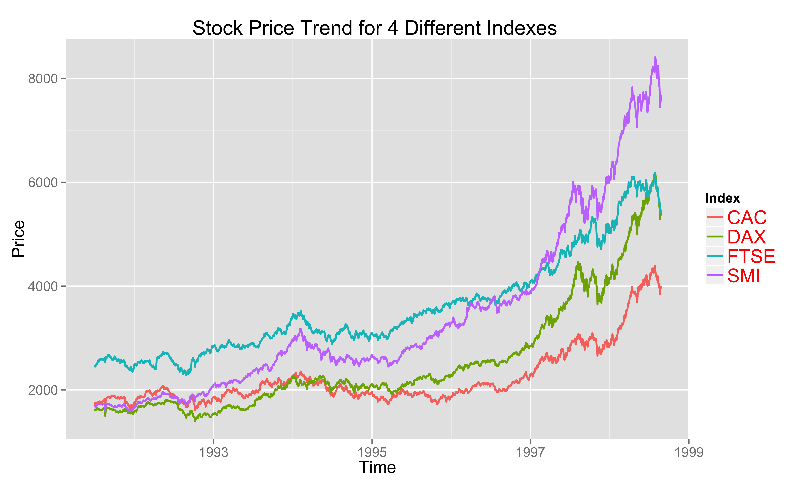

Homework 1: Basic Charts
==============================

| **Name**  | CAN JIN (Cindy) |
|----------:|:-------------|
| **Email** | cjin7@dons.usfca.edu |

## Instructions ##

The following packages must be installed prior to running this code:

- `ggplot2`
- `devtools`


To run this code, please enter the following commands in R:

```
library(devtools)
source_url("https://github.com/Cindy597/msan622/blob/master/homework1/cindy_homework1.r")
```

This will generate 4 images, including a scatterplot, bar chat, small multiples plot and nulti-line plot. See the following Discussion part for details.

Optional: In order to keep the generated four png files, please set up you own working directory before running the code by entering the following command in R:

```
setwd("/working directory") 
```


## Discussion ##

First, I performed some transformations of movies dataset and EuStockMarkets dataset in R to prepare for the visualization.
Second, I created 4 plots by using R and ggplot2 according to the requirements.

Plot1:  Produced a scatterplot from the movies dataset in the ggplot2 package, where budget is shown on the x-axis and rating is shown on the y-axis.


First of all, since 'budget' displays in E-notation, which is not simple for audience to understand quickly, I scaled the budget from dollar to million unit; 
I changed the point size by `size=2.5` in `geom_point` to avoid messy plot because there are too many data points. In addition, instead of easily plotting 
'budget' and 'rating',I grouped the data points based on 'genre' by adding `aes(colour=factor(genre)` in `geom_point`.In order to make the plot beautiful, I changed
the legend title, and I also changed the size and color of all text elements in the plot, including plot title, xlab, ylab,legend title, and legend text to help 
audience understand the insights of this plot clearly. 


Plot2: Counted the number of action, adventure, etc. movies in the genre column of the movies dataset, and produced a bar plot.


In order to lead audience only focus on the count of movies by genre, instead of color or shape of the plot, I just used single and grey color by `fill="#56B4E9"` in `geom_bar`.
For audience's convenience to compare the count of each genre type, I plotted a decreasing bar plot by creating a new movie dataset based on decreasing 'genre' levels, using the R 
code shown as below:
`my_movies<- within(movies, genre <- factor(genre, levels=names(sort(table(genre), decreasing=TRUE))))`.
In addition to change the size and color of all text elements in the plot as plot1, I also changed the color of axis.text to red, to highlight the movie type and count numbers.


Plot3: Used the genre column in the movies dataset to generate a small-multiples scatterplot using the facet_wrap() function such that 
budget is shown on the x-axis and rating is shown on the y-axis


Plot4: Produced a multi-line chart from the eu dataset with time shown on the x-axis and price on the y-axis

