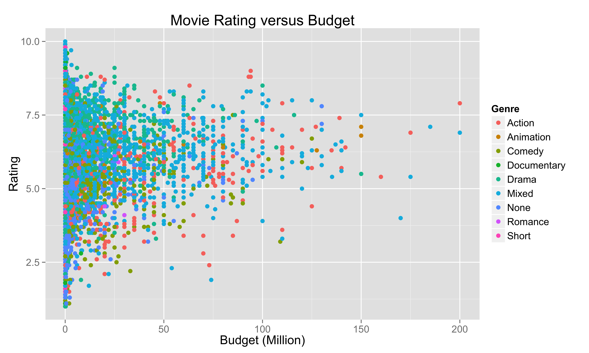
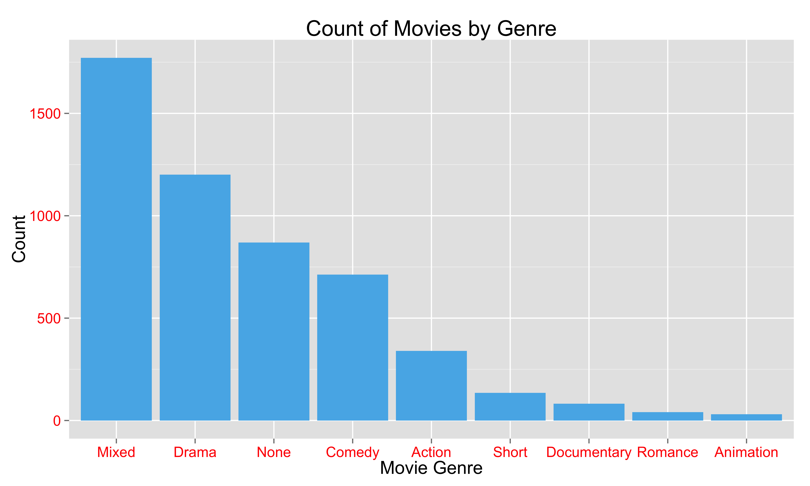

Homework 1: Basic Charts
==============================

| **Name**  | CAN JIN (Cindy) |
|----------:|:-------------|
| **Email** | cjin7@dons.usfca.edu |

## Instructions ##

The following packages must be installed prior to running this code:

- `ggplot2`
- `devtools`


To run this code, please enter the following commands in R:

```
library(devtools)
source_url("https://github.com/Cindy597/msan622/blob/master/homework1/cindy_homework1.r")
```

This will generate 4 images, including a scatterplot, bar chat, small multiples plot and multi-line plot. See the following Discussion part for details.

Optional: In order to keep the generated four png files, please set up you own working directory before running the code by entering the following command in R:

```
setwd("/working directory") 
```


## Discussion ##

First, I performed some transformations of movies dataset and EuStockMarkets dataset in R to prepare for the visualization.
Second, I created 4 plots by using R and ggplot2 according to the requirements.

Plot1:  Produced a scatterplot from the movies dataset in the ggplot2 package, where budget is shown on the x-axis and rating is shown on the y-axis.



First of all, since 'budget' displays in E-notation, which is not simple for audience to understand quickly, I scaled the budget from dollar to million unit; 
I changed the point size by `size=2.5` in `geom_point` to avoid messy plot because there are too many data points. In addition, instead of easily plotting 
'budget' and 'rating',I grouped the data points based on 'genre' by adding `aes(colour=factor(genre)` in `geom_point`.In order to make the plot beautiful, I changed
the legend title, and I also changed the size and color of all text elements in the plot, including plot title, xlab, ylab,legend title, and legend text to help 
audience understand the insights of this plot clearly. 


Plot2: Counted the number of action, adventure, etc. movies in the genre column of the movies dataset, and produced a bar plot.



In order to lead audience only focus on the comparison between genre in terms of count, instead of color or shape of the plot, I just used single and grey color by `fill="#56B4E9"` 
in `geom_bar`. However, in order to stick with the story about a specific movie genre, for example "Drama", we can just color the "Drama" bar differently to all the others.
For audience's convenience to compare the count by movie genre, I plotted a decreasing bar plot by creating a new movie dataset based on decreasing 'genre' levels, using the R 
code shown as below: `my_movies<- within(movies, genre <- factor(genre, levels=names(sort(table(genre), decreasing=TRUE))))`.
In addition to change the size and color of all text elements in the plot as plot1, I also changed the color of axis.text to red, to highlight the movie genre and count numbers.
Last, I removed the legend since it only makes the plot more complex to understand.


Plot3: Used the genre column in the movies dataset to generate a small-multiples scatterplot using the facet_wrap() function such that 
budget is shown on the x-axis and rating is shown on the y-axis


I used `facet_wrap(~genre,nrow=3)` to generate this multiples scatterplot. Since there are 9 types of movies, I got perfect 3x3 grid of panels
by setting `nrow=3`. As plot 1, I rescaled the movie budgets from dollar to million unit to improve the readability of the intensive xlab. 
Also, I kept the same point size, theme, and color in this plot as plot 1, which made my plots kind of consistent with each other. Last, people 
may confused about so many subplots, I did not remove the legend since the legend title clearly showed that the data was grouped by 'Genre'.


Plot4: Produced a multi-line chart from the eu dataset with time shown on the x-axis and price on the y-axis


In order to generate this plot, I created a new data frame with three columns of index, price, and time, which could be applied
into 'ggplot2' directly. Then the data was grouped by `group=factor(index)` in `geom_line()`. Since the purpose of this plot was to show 
the difference of trend between four indexes, I enlarged the fonts of legend. Also for this case, I kept the minor grid axes since it was 
helpful to show the yearly trend of stock prices.


Note: All the plots have same text size and color to keep consistency.

