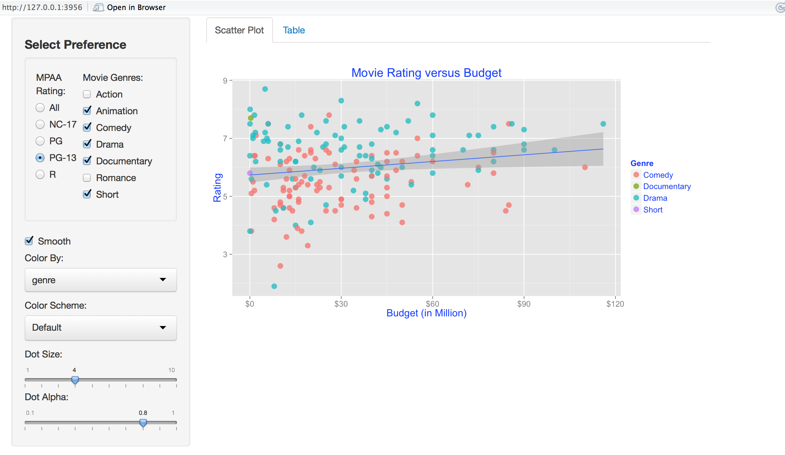

Homework 2: Interactivity
==============================

| **Name**  | CAN JIN  |
|----------:|:-------------|
| **Email** | cjin7@dons.usfca.edu |

## Instructions ##

The following packages must be installed prior to running this code:

- `ggplot2`
- `shiny`

To run this code, please enter the following commands in R:

```
library(shiny)
shiny::runGitHub('msan622', 'Cindy597', 'homework2')
```

This will start the `shiny` app. See below for details on how to interact with the visualization.

## Discussion ##

**Basic requirement:**
   * I transformed the data to prepare for the visualization: filtered invalid rows, added genre column
   * I created an interactive scatterplot of the movies dataset using the `ggplot2` and `shiny` package (
      the basic scatterplot has budget on the x-axis, the IMDB rating on the y-axis.
   * I added several widgets to my `shiny` interface: MPAA Rating, Movie Genres, Color Scheme, Dot Size, Dot Alpha.


**Customization:**
* I added a checkbox of smooth that allows the user to choose whether add regression line on the scatter plot or not. Scatter plot 
is always straight forward for audience to understand the rough structure of the dataset, however, it is difficult for audience 
to notice the distribution (main located area) and outliers of the dataset. Adding regression line and confidence interval on 
the scatter plot can help audience to roughly point out the outliers and central distribution area.  
If the box is checked (smooth equals TRUE), just add `geom_smooth(method=lm)` in `ggplot`.


* In additional to the scatter plot, I also show a sortable data table. Since the scatter plot only shows a big picture of the data
distribution, add a table is necessary for showing more detailed information to the audience. The table showed is based on the 
selection of 'genre' and 'mpaa'. And I only showed several columns either contain basic information (title, year), or relate to the scatter 
plot (budget, rating, genre, mpaa) instead of all the columns in the data to avoid messy caused by useless information.

* Based on the basic setting of sidebar panel, the ratio buttons of MPAA and the group check boxes of Movie genres, which display vertically,
occupied most of the space of the sidebar panel (not a good layout). In order to save space, I made them display side by side horizontally based on the 
following code:
```
    sidebarPanel(width=3,
                 h4("Select Preference"),     
                 wellPanel(
                   div(class="row",
                       div(class="span1"),
                       div(class="span4",radioButtons(
                         "vectormpaa", 
                         "MPAA Rating:", 
                         c("All", "NC-17","PG","PG-13","R"))),
                       div(class="span6",checkboxGroupInput(
                         "vectorgenre",
                         "Movie Genres:",
                         c("Action","Animation","Comedy","Drama","Documentary","Romance","Short"),
                         selected=NULL))))  
```

* In addition to color the scatter plot just by 'mpaa', I added a drop-down box that allows the user to choose which variable that the scatter
 plot will be colored by ('mapp' or 'genre').


   


**Interact with the visualization:**


My `shiny` interface:


  * Select preference: Select any single type from MPAA, and any multiple types from Movie Genres. The scatter plot
  can be generated specifically for any combination. The default value for MPAA Rating is 'All', and all genres 
  will be shown when none of the checkboxes are selected.
  * Smooth: Check this button to add regression line on the scatter plot. The default value is 'TRUE'.
  * Color By: Select the variable ('mpaa' or 'genre') that you want to color the scatter plot . The default value is 'mpaa'.
  * Color Scheme: Select any color scheme you prefer for the scatter plot. The default value is 'Default'.
  * Dot Size: Slide the button to select the dot size in `geom_point()`. It ranges from 1 to 10, and it steps by 1. The default 
  value is 4.
  * Dot Alpha: Slide the button to select the alpha value in `geom_point()`. It ranges from 0.1 to 1, and it steps by 0.1. The default 
  value is 0.8.
  
The following is an additional screenshot of my `shiny` interface after changing several settings:
  

	


