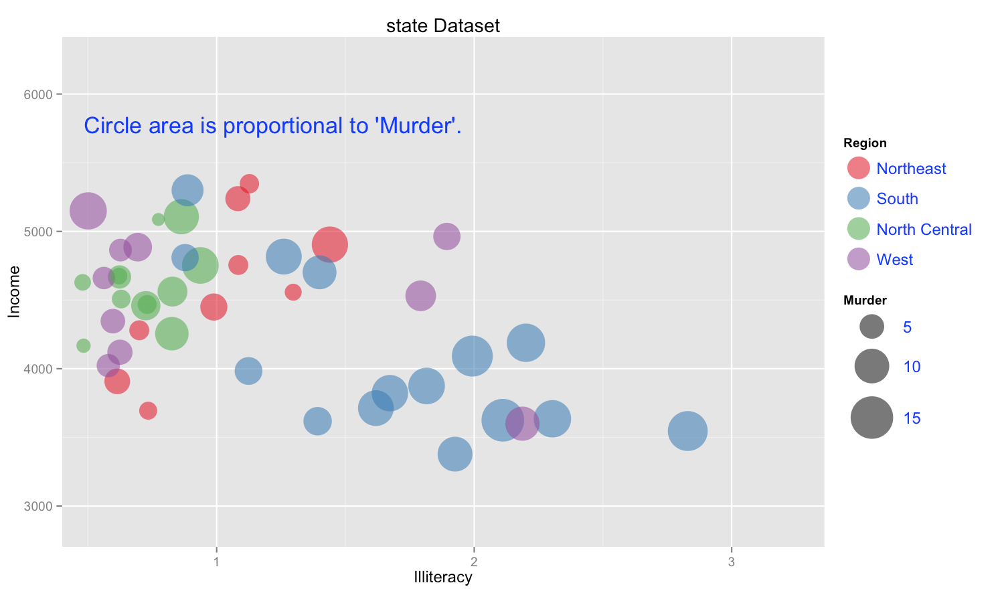

Homework [#]: [HOMEWORK NAME]
==============================

| **Name**  | [YOUR NAME]  |
|----------:|:-------------|
| **Email** | [USERNAME]@dons.usfca.edu |

## Instructions ##

Use the following code to run this `shiny` app:

```
library(shiny)
runGitHub("msan622", "[username]", subdir = "homework3")
```

## Discussion ##

### Technique 1: [TYPE] ###

Story: 
X-axis : Life Expectation
Y-axis: Income
Color: Division
Size: Murder

How life expectation and income effect the number of murders (in a State) for different divisions?
Based on the plot, we can see States with low life expectation, the murder size is very large regardless of
the income level of the state. For middle-level life expectation, high income state have little murder size,
while low or middle level income states have relatively high murder size (randomly, relatively high income may 
not have higher murder size than lower income level)

More in detail, New England and West North Central have relatively small murder size, while all of South Atlantic, East South Central and 
West South Central states have relatively large murder size.


Customization:
1). keep scale area size (bubble size) for customer easy to compare how bigger the buddle for one state than another state (provide 
criteria for comparing murder size)

2). Since the murder size the most important information I trying to focus audience's attention, I added a blue title on the plot to 
show Circle area (bubble) is proportional to Murder. Also I changed the legend color to blue and increased the text size of it to 
highlight them.




[DISCUSSION]

### Technique 2: [TYPE] ###

Story: 
Selected columns for scatter-matrix: Population, Life Expectation, Income, Illiteracy.
The column to use for coloring data: Region.


Customization: In addition to the density plots in the matrix diagonal, add legend in the right side to show 
the region information for different color.


[DISCUSSION]

### Technique 3: [TYPE] ###


Story:  
columns selected for parallel coordinate plot: Population, Life Expectation, Murder, Income, Illiteracy.
The column to use for coloring data: Division.

Customization: Added `showPoints=TRUE` in `ggparcoord` to show points in the plot. In addition to the line 
showed in the plot, the points can show a big picture about the dense and distribution of each column. 
        
        
        


[DISCUSSION]

### Interactivity ###


[DISCUSSION]


