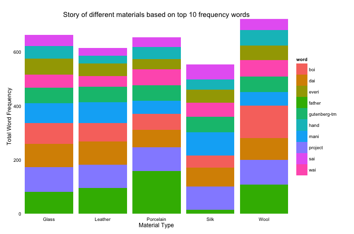
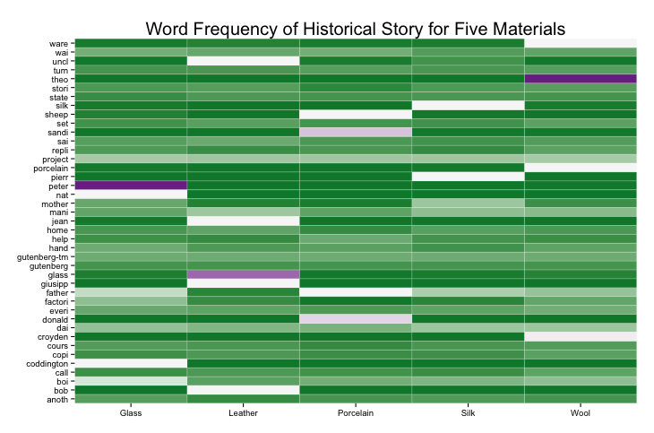
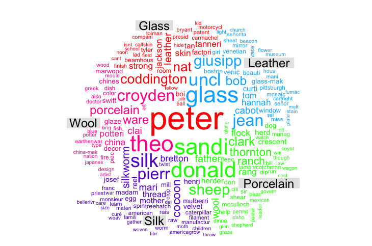

Homework 4: Text Visualization
==============================

| **Name**  | CAN JIN |
|----------:|:-------------|
| **Email** | cjin7@dons.usfca.edu |

## Instructions ##

The following packages must be installed prior to running this code:
- `ggplot2`
- `tm`
- `SnowballC`
- `wordcloud` 
- `devtools`

## Discussion ##
```
library(devtools)
source_url("https://github.com/Cindy597/msan622/blob/master/homework4/cindy_hw4.r")
```


 
## Dataset 
 My dataset is a collection of five text files (eBooks) about five different materials' story downloaded from
 Project Gutenberg.
 
 Those five materials are Wool, Silk, Porcelain, Leather, and Glass. All of them are common in our daily life.
 
 The reason I chose this dataset is I wanted to look inside about the difference of those different materials' history.
 We are using those materials everyday, but we do not know their story and manufacture. 
 Knowing their difference also helps us to select the right materials for ourself. For example, silk and wool are different 
 cloth materials we can choose from.
 
 Therefore, my visualization purpose is to explore the similarity and  difference of the most frequency (top 10 or other criteria)
 words between different materials' history or story.
 
 Text 1: The Story of Wool by Sara Ware Bassett
 Link:   http://www.gutenberg.org/cache/epub/24858/pg24858.txt
 Text 2: The Story of Silk by Sara Ware Bassett
 Link:   http://www.gutenberg.org/cache/epub/25025/pg25025.txt
 Text 3: The Story of Porcelain by Sara Ware Bassett
 Link:   http://www.gutenberg.org/cache/epub/19423/pg19423.txt
 Text 4: The Story of Leather by Sara Ware Bassett
 Link:   http://www.gutenberg.org/cache/epub/25823/pg25823.txt
 Text 5: The Story of Glass by Sara Ware Bassett
 Link:   http://www.gutenberg.org/cache/epub/20698/pg20698.txt
 
 Total number of words in those five files are greater than one thousand and less than a million.
 
 
## Transformation and Text Mining to the dataset ##

* Got Stem languages ( `Porter`)
* Removed specific words ( Created my own stopwords list for this specific dataset)
* Calculated frequencies 
* Converted the dataset to frequency formart
* Sorted the dataset by frequency
* Removed row names 

    Note: Some detailed steps are ignored here, please check the attached code for more information.
    

## Visualization 1: Bar Plot ##

Since my dataset are composed of five text files for five different materials, I am more interested in the similarity and 
difference between all those five materials, instead of only two of them. So I chose bar plot instead of frequency plot which is 
just show the information for two material types. 

In addition to the simple bar plot, I created a stacked bar plot shown the frequency of top 10 words by five different materials 
types. The plot is shown below:



This plot shows the top 10 most frequent words and how frequently they were observed in each of the five materials, which uses 
colors to distinguish between the various words. The code for this is `ggplot(bar_df, aes(x = type,y = freq,fill=word))`.

Customization: 
* Removed grid, ticks, and excessive annotation for data ink ratio. 
* Made the font size small(a little bit, still clear for read) of legend for data ink ratio.
* Made the plot area bigger for data density 

Evaluation: The lie factor of this plot is 1 since there is no misrepresentation and the size of bars are just based on the 
accurate count of words. Even though the data-ink ratio will be reduced by adding a legend of words in this plot, I think the legend
is still necessary for users to understand the insight of this plot. I think the data-ink ratio is good for this plot after I removed 
excessive grid, annotation, and ticks. The density rate is also good for this plot obvious.


## Visualization 2: Heat-map Plot ##

The above bar plot is good for limited number of words shown on plot, however, heatmap is a good technique to show the frequency for much more
words by five different material types. Here is the heatmap plot top 50 most frequent words. The words on Y-axis is decreasingly sorted by 
term frequency, and the x-xis shows material types.



Customization: 
* Ordered my dataset by term frequency
* Added labels on my plot
* Removed excessive axis titles, grid, and legend for data ink ratio
* Kept tick marks in order to distinguish the densely located words on y-axis
* Changed color panel


Evaluation:  The lie factor of this plot is also 1 since there is no misrepresentation and the color of each cell is just based on the 
accurate count of words. The data-ink ratio is good for this plot after I removed excessive axis titles, grid, and legend. 


## Visualization 3: Word-cloud Plot ##

In addition to a basic word cloud, I created a 'Comparison Cloud' plot, in which the words are colored by different comparison groups (in my case, this 
is those five different material types). The plot is shown below:



Similar to basic word cloud plot, the size and color scheme of word are proportional to the term frequency, but colors distinguish the different material groups.

Customization: 
* Reformatted my dataset to get the comparison cloud plot
* Changed the max words setting in `comparison.cloud()` to fit the cloud into the plot area --- also changed data density
* Made the plot area large for data density
* Customized own color scheme for comparison 
* Added title for different material types in the plot

Evaluation:

The lie factor of this plot is relatively low compared to above two plots since the size and color of words are not based on the 
accurate term frequency (proportional or scaled) in order to make a 'word cloud' for many words; while the data-ink ratio and data density are relatively high in this plot.


 

 
 

 
 
 