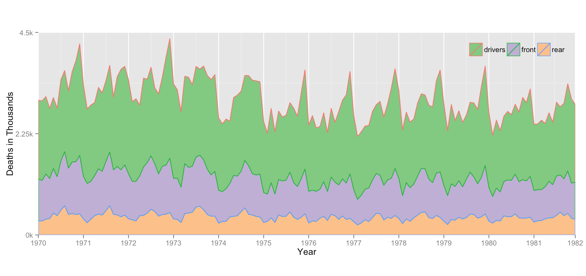
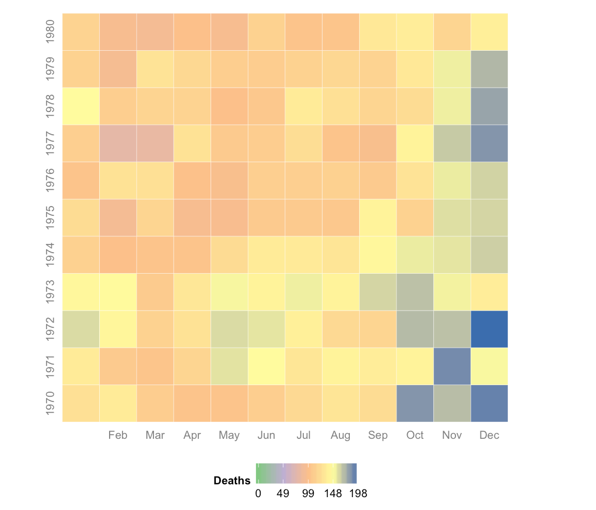
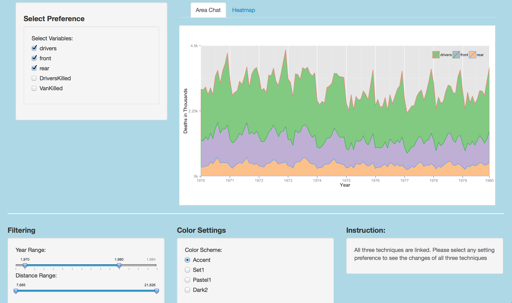
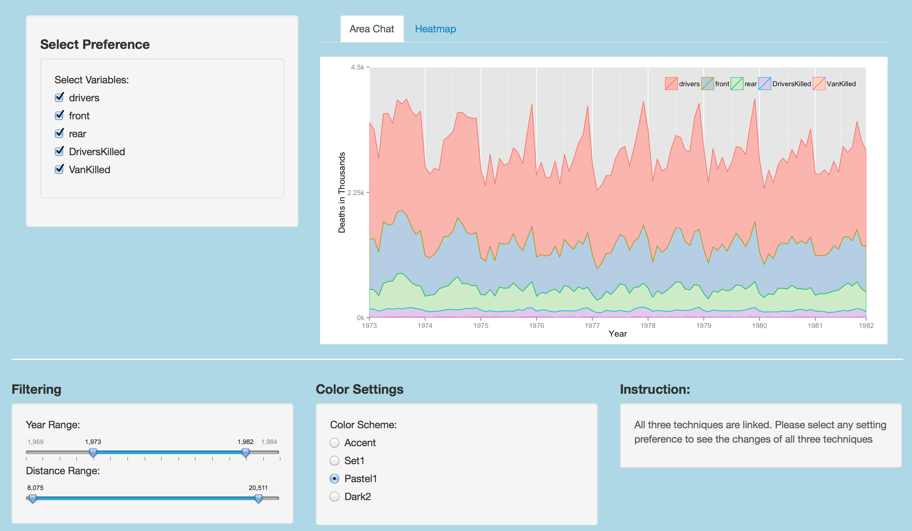
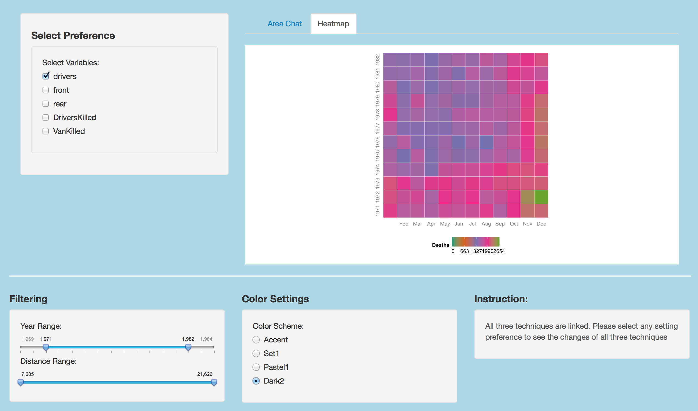

Homework 5: Time Series Visualization
==============================

| **Name**  | CAN JIN (Cindy)  |
|----------:|:-------------|
| **Email** | cjin7@dons.usfca.edu |

## Instructions ##

The following packages must be installed prior to running this code:

- `ggplot2`
- `shiny`
- `grid`
- `GGally`
- `reshape`
- `plyr`
- `scales`


Use the following code to run this `shiny` app:

```
library(shiny)
shiny::runGitHub('msan622', 'Cindy597', subdir='homework5')
```

## Discussion ##

I chose option 2: Interactive with two linked techniques.

**Dataset:** I converted `Seatbelts` dataset to a melt data frame to plot in ggplot2, please see my choice for labels,
grouping, colors, fills, and facets below in detail.


### Technique 1: Stacked Area Plot ###

X-axis : Year
Y-axis: Deaths in Thousands
Color: Variable (Category of death or injury) 


Story: What's the trend (may be seasonality) of deaths or injuries in different type by years from 1969 to 1984 ?

Reason for using stacked area plot: Stacked area plot displays several time series as stacked area for clear comparison. 
It shows us the  comparable area in terms of the size of deaths between variables. It is easy for users to see the trend or seasonality of deaths
for several different types.



Based on the plot, we can see the deaths of drivers is largest compare to that of front and rear. Also, we can see the obvious trends of deaths
for each type of death.


Customization:

* Added line to the stacked area plot to make the comparison of different death types easier;
* Changed the theme of legend position
* Removed excessive annotation for data ink ratio;
* Made major and minor grid thinner for data ink ratio.
* Made the font size small(a little bit, still clear for read) of legend for data ink ratio.
* Made the plot area bigger for data density.
* Scaled by year 
* Scaled by death based on the limits of death of the variable type
* Changed the color scheme for easier clarity.

Evaluation: The lie factor of this plot is 1 since there is no misrepresentation and the size of area are just based on the 
accurate count of deaths of each type. Even though the data-ink ratio will be reduced by adding a legend of words in this plot, I think the legend
is still necessary for users to understand the insight of this plot. I think the data-ink ratio is good for this plot after I removed 
excessive annotation, and made the major and minor grid thinner. The density rate is also good for this plot obvious.


### Technique 2: Heatmap ###

Selected columns for Heatmap: One of "drivers", "front", "rear", "DriversKilled", "Vankilled"
The column to use for coloring data: same as above,
The column to use for sizing data: same as above.

X-axes: Month
Y-axes: Year
size: Deaths

Story: Explore the (big picture) trend of deaths for each month by year from 1968 to 1984.



Based on the plot above, we can see there were always more deaths in Nov. and Dec. each year for "divers" type, while 
more deaths in July and Aug. for "front" and "rear" types. In terms of "Vankilled", it is pretty random.


Customization: 

* Removed tick and excessive annotation for higher data ink ratio;
* Made major and minor grid thinner for data ink ratio.
* Made the plot area bigger for data density ;
* Changed the color scheme for easier clarity in R `ColorBrewer` --- divide the length from 0 to max deaths of the type by 4
* Scaled by month 

Evaluation:
The lie factor of this plot is also 1 since there is no misrepresentation and the color of each cell is just based on the 
accurate count of words. The data-ink ratio is good for this plot after I removed excessive axis titles, and grid. I changed 
the plot area to make the data density reasonable.


### Interactivity ###


*window 1



*window 2


*window 3



**Approaches**
1. All three techniques are linked. That means change any setting preference will see the changes of all three techniques; 
   For example, if you select 'drivers' in `Select Variables`, all three techniques should just plot for "drivers" death;
   
2. Applied Filtering techniques in my shiny interface.
    
   Filtering: By Year and Distance range. By adding two slider bars with two buttons to control their range, I can subset my dataset
   easily for filtering.
 
 3. Select any variables in to my plot (challenge): In stead of selecting certain variables to label, 
    I can select any at least variables interested in the stacked area chat, and select only one variable for Heatmap.
    One challenge is I needed to change xlim and ylim every time when 
    the selected variables changed. For example, in Stacked Area chat, when variable changed from front to rear, 
    the xlim, ylim, xlab, ylab,etc. also changed.

 **Interactive steps:**  
  * Select variables: 
     Select at least two variables for Stacked Area Chat;
     Select only one variable for Heatmap;
     (Do not worry! There will be a hint/warning for you to make correct selection)
  * Filtering: Select any Year and Distance range you want to explore further;
  * Color Setting: Select any color scheme you prefer to control the color panel of all three plots;
  * Instruction: Yeah! There is a brief instruction to help audience to interactive easily.
  
The following are some additional screenshots of my `shiny` interface after changing several settings:

* window 1
 
 
* window 2 
 
 
* window 3
 

