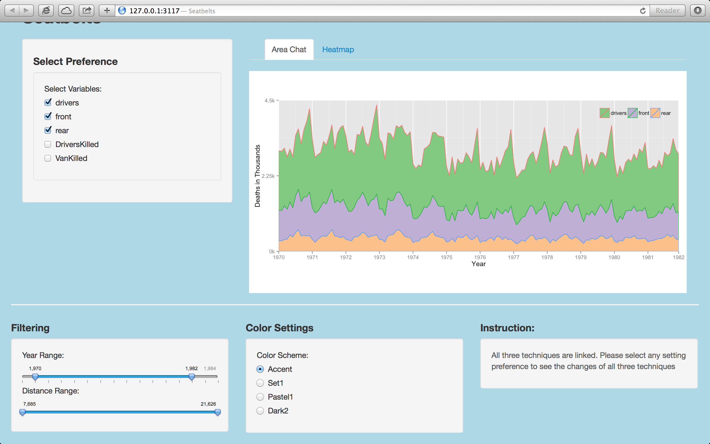

Homework 5: Time Series Visualization
==============================

| **Name**  | CAN JIN (Cindy)  |
|----------:|:-------------|
| **Email** | cjin7@dons.usfca.edu |

## Instructions ##

The following packages must be installed prior to running this code:

- `ggplot2`
- `shiny`
- `grid`
- `GGally`
- `reshape`
- `plyr`
- `scales`


Use the following code to run this `shiny` app:

```
library(shiny)
shiny::runGitHub('msan622', 'Cindy597', subdir='homework5')
```

## Discussion ##

I chose option 2: Interactive with two linked techniques.

**Dataset:** I converted `Seatbelts` dataset to a melt data frame to plot in ggplot2, please see my choice for labels,
grouping, colors, fills, and facets below in detail.


### Technique 1: Stacked Area Plot ###

X-axis : Illiteracy
Y-axis: Income
Color: Region
Size: Murder

Story: How Illiteracy and Income affect the number of murders (in a State) in different Regions?

Reason for using Bubble Plot: Bubble plot displays a set of numeric values as circles. It shows us the  
correlational relationships between variables. Also, it is easy for 
audience to understand how Illiteracy and Income effect the number of murders by comparing bubbles' size.
Last, Bubble plot looks beautiful, I think it is a good technique to be shown in shiny interface.


Based on the plot, we can see States with high Illiteracy, the murder size is very large regardless of
the income level of the state. For middle-level Illiteracy, high income state have little murder size;
however,low or middle level income states have relatively high murder size (randomly, relatively high income may 
not have higher murder size than lower income level); last, low-level Illiteracy states with low-level Income 
have litter murder size than that with high-level Income (surprising)

More in detail, South states have relatively big murder size with high-level Illiteracy and low-level Income;
while West and North Central states have relatively small murder size with low-level Illiteracy and high-level Income.


Customization:

* In order to avoid large bubbles overlap small bubbles,I reordered my dataset before `ggplot`;

* I kept the legend of bubble size for customer to easily compare that how bigger the buddle for one state
 than another state (provide criteria for comparing murder size);

* Since the murder size is the most important information I am trying to attract audiences' attention, 
I added a blue title on the plot to show Circle area (bubble size) is proportional to Murder. 
Also I changed the legend color to blue and increased the text size of it to highlight them.


### Technique 2: Heatmap ###

Selected columns for scatter-matrix: Population, Life Expectation, Income, Illiteracy,Murder.
The column to use for coloring data: Region.

Story: Explore the relationships between Population, Life Expectation, Income, Illiteracy, and Murder to find out 
some interesting insights about them.

Reason for using Scatter Matrix plot: Without any assumption about those columns, ScatterMatrix plot is a better way 
to find out some useful insights about their correlations to help us make a further hypothesis.


Based on the plot above, we can get any information we want about specific columns by both density and scatter plots.

Customization: 

* Scatter Matrix looks a little bit more complex than other plots. In order or make the plot as simple as possible,
I set the upper side of the matrix as blank by `upper = "blank"`;
* I deleted X and Y axises of the density plots on diagonal to keep the ScatterMatrix plot clear and simple.


### Technique 3: Parallel Coordinates Plot ###


columns selected for parallel coordinate plot: Population, Life Expectation, Murder, Income, Illiteracy.
The column to use for coloring data: Region.

Story: Explore the data distribution and columns' relationship of Population, Life Expectation, Murder, Income, and Illiteracy . 

Reason for using Parallel Coordinates plot: It is a good technique to explore data distribution and columns' relationship
before any assumption. Also, the size of our dataset (only 50 obs) is appropriate for this technique.


Based on the plot above, we can see those lines are mess-up, which is due to the limitation of our dataset. However, in the plot, 
we can see a kind of trend for South (up-down-up-down, blue color).The highlight of South can be seen in my shiny interface by the 
Brushing button.

Customization: 

* I added `showPoints=TRUE` in `ggparcoord` to show points in the plot. In addition to the lines 
shown in the plot, the points can display a big picture to audience about the dense and distribution of each variable;
 
* In order to retrive the trend for a specific region, I modified my code to add a highlight function. The code is shown fellowing:
```
palette<-brewer_pal(type="qual",palette=color_theme)(4)
Region<-levels(sub_data$Region)
palette[which(!Region %in% vector_Region_highlight)]<-"grey"
p3<-p3+scale_color_manual(values=palette) 

```
        


### Interactivity ###


*window 1



*window 2


*window 3


**Approaches**
1. All three techniques are linked. That means change any setting preference will see the changes of all three techniques; 
   For example, if you select 'West' using brushing, all three techniques should brush 'West' in plot;
   
2. Applied  Brushing and Filtering techniques in my shiny interface.
   Brushing: By Region. Since all my plots are colored by Region, Brushing also by Region is a easiest way. I added the highlight code 
   (shown above) in each plot. But the ScatterMatrix is a little bit different. I need access the diagonal and lower sider separately to 
   change the preference. The fellowing code shown how to brush a certain Region type from plot along non-diagonal:
    
    ```
        for (i in 1:(ncol(sub_data)-1)){
          for (j in 1:(ncol(sub_data)-1)){
            if (i!=j){
              inner=getPlot(p2,i,j);
              palette<-brewer_pal(type="qual",palette=color_theme)(4)
              Region<-levels(sub_data$Region)
              palette[which(!Region %in% vector_Region_highlight)]<-"grey"
              inner<-inner+scale_color_manual(values=palette) 
              inner<-inner+geom_point(size=bubble_size)
              # Put it back into the matrix
              p2 <- putPlot(p2, inner, i, j);
            }
          }
        }
    ```
    
   Filtering: By Population and Income range. By adding two slider bars with two buttons to control their range, I can subset my dataset
   easily for filtering.
 
 3. Select any variables in to my plot (challenge): In stead of selecting certain variables to label, 
    I can select any two variables as x-axis and y-axis in bubble plot, and select any at least two variables to shown 
    ScatterMatrix and ParallelCoordinate plots. One challenge is I needed to change xlim and ylim every time when 
    the selected variables changed. For example, in bubble plot, when x-axis changed from Life.Exp to Illiteracy, 
    the xlim, ylim, xlab, ylab,etc. also changed. The code I used to fix this problem is shown below:
    ```
    p1 <- p1 + scale_x_continuous(
            limits = c(min(sub_data$V2)-min(sub_data$V2)*20/100, max(sub_data$V2)+max(sub_data$V2)*20/100),
            expand = c(0, 0))  
          p1 <- p1 + scale_y_continuous(
            limits = c(min(sub_data$V1)-min(sub_data$V1)*20/100, max(sub_data$V1)+max(sub_data$V1)*20/100),
            expand = c(0, 0))  
          p1 <- p1 + labs(
            size = "Murder",
            x = colnames(sub_localFrame)[variables[2]],
            y = colnames(sub_localFrame)[variables[1]]) 
          p1 <- p1 + annotate(
            "text", x = min(sub_data$V2), y = max(sub_data$V1)+max(sub_data$V1)*8/100,
            hjust = 0.01, color = "blue",
            label = "Circle area is proportional to 'Murder'.",size=6)
            
    ```
    
   
 **Interactive steps:**  
  * Select variables: 
     Select only two variables for Bubble Plot;
     Select at least two variables for ScatterMatrix and ParallelCoordinate Plots;
     (Do not worry! There will be a hint/warning for you to make correct selection)
     
  * Brushing: Select any Region type you want to be brushed in all three plots;
  * Bubble/Point size: All the bubble or point size in three plots can be controlled by this;
  * Filtering: Select any Population and Income range you want to explore further;
  * Color Setting: Select any color scheme you prefer to control the color panel of all three plots;
  * Instruction: Yeah! There is a brief instruction to help audience to interactive easily.
  
The following are some additional screenshots of my `shiny` interface after changing several settings:

* window 1
 
 
* window 2 
 
 
* window 3
 

