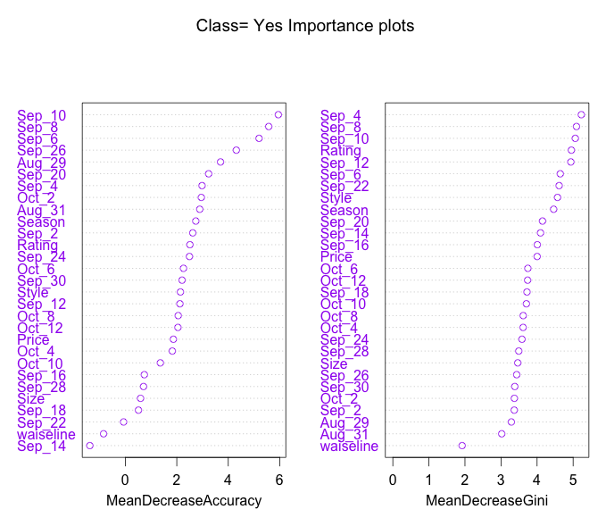
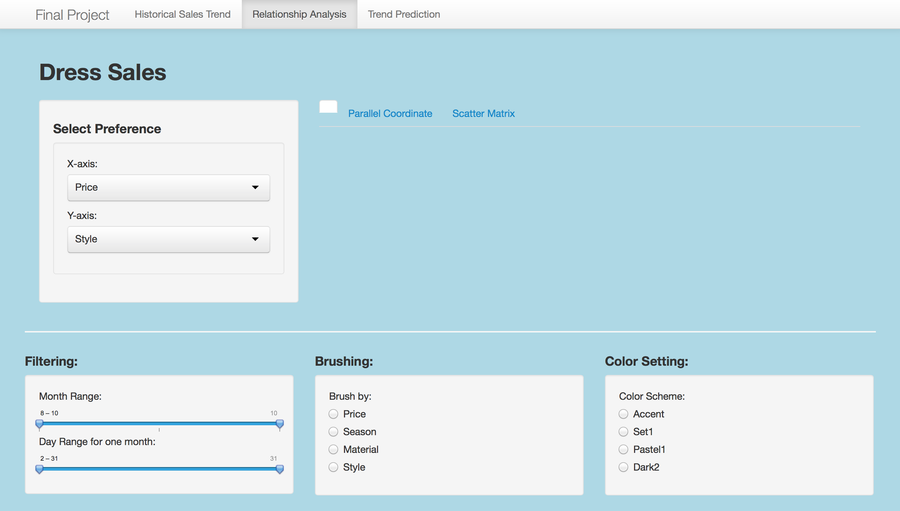

Project: Prototype
==============================

| **Name**  | CAN JIN (Cindy)  |
|----------:|:-------------|
| **Email** | cjin7@dons.usfca.edu |

## Discussion ##

## Dataset ##
My dataset is about dress sales for 550 different types of dresses distinguished by `Dress ID`. The dataset includes
historical sales records from 2013/08/29 to 2013/10/12, and several attributes like 'style', 'price', 'size' and so on.
And there is a binary variable called 'Recommendation' to indicate whether a specific dress will be recommended for other
customers (friends).

The following is a three-sample subset to show what my dataset looks like:

## One possible plot ##

As I mentioned above, there is a binary variable called 'Recommendation' to indicate whether a specific dress will be recommended for other
customers or friends in my dataset. I decided to implement a `Random Forest` model to predict whether a dress should be recommended or not.
After building the model, I got the importances of features (independent variables) for predicting `recommendation`, which indicates
how important that variable is in classifying the data.
The feature with higher importance means it has more effect on this model. 
The plot shows each variable on the y-axis, and their importance on the x-axis.
They are ordered top-to-bottom as most-to-least importance.  Therefore, the most important variables are at the top and an estimate of their 
importance is given by the position of the dot on the x-axis. You should use the most important variables, as determined from the variable
importance plot, in the PCA, CDA, or other analyses. 
In addition, there are two importance criteria
called 'MeanDecreaseAccuracy' and 'MeanDecreaseGini' respectively.
The more the accuracy of the random forest decreases due to the addition of a single variable, the more important the variable is deemed, and
therefore variables with a large mean decrease in accuracy are more important for classification of the data.  
While Mean Decrease Gini shows a big picture how to split the decision tree in the random forest model.
Variables with high purity have more effect on how to split the tree.

***

## Expected Interface ##

***

***

***
