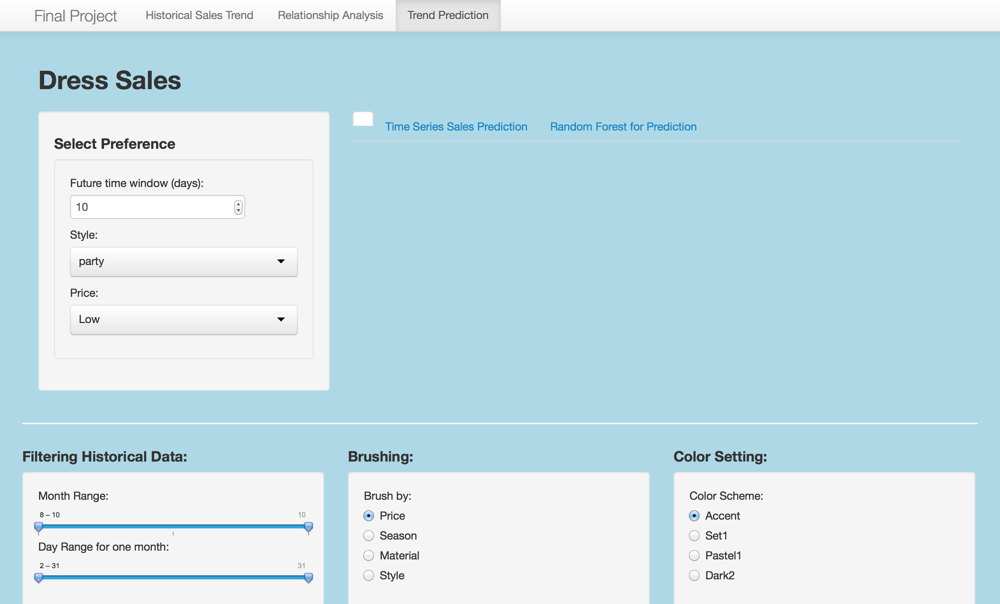

Project: Prototype
==============================

| **Name**  | CAN JIN (Cindy)  |
|----------:|:-------------|
| **Email** | cjin7@dons.usfca.edu |

## Discussion ##

## Dataset ##
My dataset is about dress sales for 550 different types of dresses distinguished by `Dress ID`. The dataset includes
historical sales records from 2013/08/29 to 2013/10/12, and several attributes like 'style', 'price', 'size' and so on.
And there is a binary variable called 'Recommendation' to indicate whether a specific dress will be recommended for other
customers (friends).

The following is a three-sample subset to show what my dataset looks like:

## One possible plot ##

As I mentioned above, there is a binary variable called 'Recommendation' to indicate whether a specific dress will be recommended for other
customers or friends in my dataset. I decided to implement a `Random Forest` model to predict whether a dress should be recommended or not.
After building the model, I got the importances of features (independent variables) for predicting `recommendation`, which indicates
how important that variable is in classifying the data.
The feature with higher importance means it has more effect on this model. 
The plot shows each variable on the y-axis, and their importance on the x-axis.
They are ordered top-to-bottom as most-to-least importance.  Therefore, the most important variables are at the top and an estimate of their 
importance is given by the position of the dot on the x-axis. We should use the most important variables, as determined from the variable
importance plot, in the PCA, CDA, or other analyses. 
In addition, there are two importance criteria
called 'MeanDecreaseAccuracy' and 'MeanDecreaseGini' respectively.
The more the accuracy of the random forest decreases due to the addition of a single variable, the more important the variable is deemed, and
therefore variables with a large mean decrease in accuracy are more important for classification of the data.  
While Mean Decrease Gini shows a big picture how to split the decision tree in the random forest model.
Variables with high purity have more effect on how to split the tree.

***

## Expected Interface ##
My interface includes three parts: Historical Sales Trend, Relationship Analysis, and Prediction

* The first page `Historical Sales Trend` is for customers or managers to find out the trend of specific dresses.
In detail, there are two plots --- Heatmap and Multiple Line to show the big picture of 
sales trend for different dresses distinguished by `Dress ID`.

For interactivity, users can set up any selection preference associate with 'style', 'price', 'size', 'season', and 'material'.
Additional two techniques are filtering by month and day, and brushing by 'style','price', 'material', and 'season'.
Also, color scheme can be changed based on personal preference.

* The second page `Relationship Analysis` is for analyzing the relationship between features. This page is for managers to explore which attributes or features have
effect on the sales or price of a specific dress. Also, bar plot can address more detailed information by comparing several 
different dress types.

For interactivity, users can set up any selection preference for x-axis and y-axis.
Additional two techniques are filtering by month and day, and brushing by 'style','price', 'material', and 'season'.
Also, color scheme can be changed based on personal preference.

* The third page `Prediction`  is for predict dress sales by time series and predict whether a dress will be recommended for other customers (by the binary 
variable 'recommend', its value is 0 or 1) by random forest. Manegers can set up their preference about time (days) to see the predicted sales trend for further 
1 month(31 days) or other time window. Also, managers or users also can see which variables are important for prediction whether a dress will be recommended or not 
based on the importance outpout of random forest model.

***

***

***
