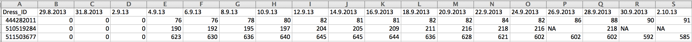
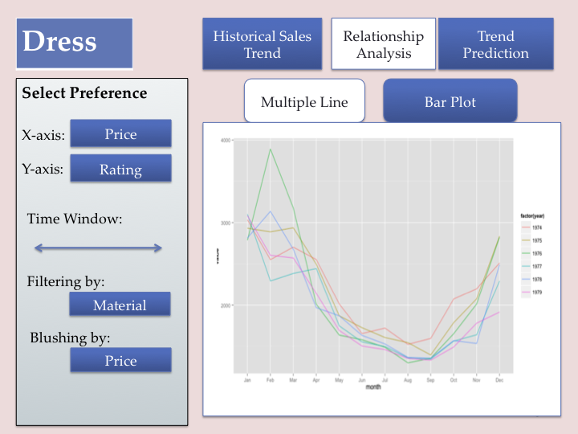
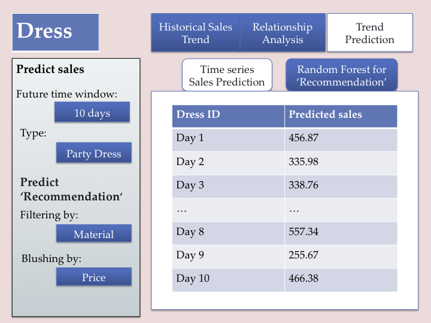

Project: Sketch
==============================

| **Name**  | CAN JIN (Cindy) |
|----------:|:-------------|
| **Email** | cjin7@dons.usfca.edu |

## Discussion ##

## Dataset ##
My dataset is about dress sales for 550 different types of dresses distinguished by `Dress ID`. The dataset includes
historical sales records from 2013/08/29 to 2013/10/12, and several attributes like 'style', 'price', 'size' and so on.
And there is a binary variable called 'Recommendation' to indicate whether a specific dress will be recommended for other
customers (friends).

The following is a three-sample subset to show what my dataset looks like:

## Planned Tools ##
I will use a combination of `R`, `ggplot2`, and `shiny` to visualize my dataset.
Also, some other packages may needed for transforming dataset and making graphs more beautiful,
like `scales`, `reshape2`, `grid`, and so on.

## Planned Techniques ##

`Heatmap`: The majority of my dataset is historical sales record for different types of dresses. A basic business 
question I want to figure out is what is the trend of sales for a specific dress type. Since there are so many 
dress types, and I cannot plot or compare them one by one, heatmap is a good idea to see the big picture of several dress types' 
sales trend on one plot.

`Paralell coordinates`: Parallel coordinates is a good technique to find out 
the relationship between several variables. For example, the relationship between sales and price.

`Bar chat`: In addition to the numerical variables in my dataset, there are several categorical features. 
Bar chat should be a good technique to compare two or several specific categorical types. For example,
Compare the sales or price between Casual dress and Party dress.

`Multiple line`:  As mentioned above, my dataset is time series, multiple line is the most straightforward way 
to indicate the trend time series for several dresses. For example, plot the scales trend for high, medium, and low 
price dresses on a same plot to see the difference.

## Planned Interaction ##
* Filtering: For heat-map, parallel coordinates, and multiple line, filtering dataset based on time.
* Brushing: Select any dress type you want to be brushed in all plots;
* Sorting: For heat-map based on sales.
* Zooming: For parallel coordinates.
  Note: My plan is to link all the plot for those interaction.
   
## Planed Interface ##

* My interface will composed with three pages for different business purpose.
  First page: Trend of sales. This page is for customers or managers to find out the trend of specific dresses.
  They can set up any selection preference.
  
  
 
* Second page: Analysis of relationship between features. This page is for managers to explore which attributes or features have
  effect on the sales or price of a specific dress. Also, some bar plot can address more detailed information by comparing several 
  different dress types.
 
   
 
* Third page: Time series prediction about sales and prediction whether a dress will be recommended for other customers (by the binary 
variable 'recommend', its value is 0 or 1). Manegers can set up their setting about time to see the predicted sales trend for further 
1 month or other time window. Also, managers also can see whether a dress will be recommended based on the result of logistic regression model.

   

